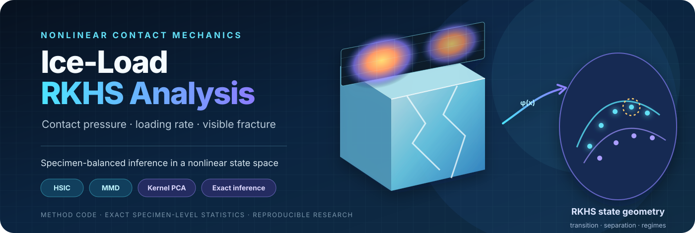
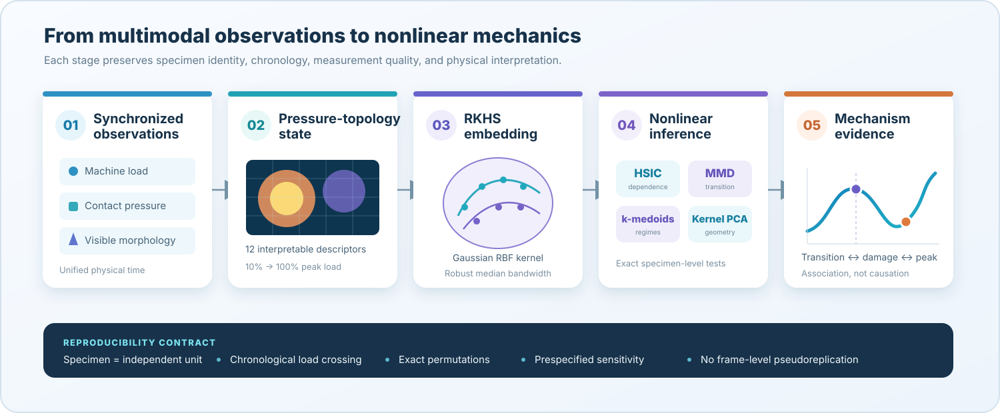
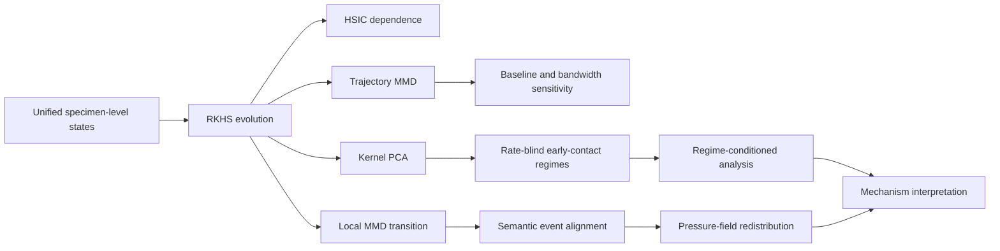

<div align="center">



<br />

[](https://www.python.org/)
[](tests)
[](LICENSE)
[](#data-and-scope-boundary)

**A specimen-balanced RKHS toolkit for nonlinear contact-pressure evolution, loading-rate comparison, and visible-fracture mechanism analysis in uniaxially compressed ice.**

[Method](#method-at-a-glance) · [Mathematics](#mathematical-core) · [Code map](#repository-map) · [Quick start](#quick-start) · [Reproducibility](#reproducibility-contract) · [Contributors](#contributors) · [Citation](#citation)

</div>

---

## Why this repository?

Ice failure is not described by a single force value. During compression, the loaded interface can expand, localize, migrate, reorganize into connected pressure patches, and become decoupled from the damage visible on a side surface. This repository turns those changes into a **nonlinear state trajectory** instead of reducing the experiment to one peak-load scalar.

The central idea is simple:

> Represent each contact-pressure state by physically interpretable spatial descriptors, map the joint state into a reproducing kernel Hilbert space, and perform inference with the **specimen—not the frame—as the independent unit**.

<p align="center">
  
</p>

## Method at a glance

| Layer | Question | Implemented method | Primary output |
|---|---|---|---|
| State construction | How is load carried across the contact face? | 12-D pressure-topology representation | Load-indexed state trajectory |
| Nonlinear dependence | Does pressure topology evolve with load progress? | Normalized HSIC + circular shifts | Dependence score and discrete null test |
| Transition detection | Where is the strongest local state reorganization? | Sliding-window biased MMD² | Specimen-specific transition state |
| Rate comparison | Do loading-rate groups occupy different trajectory distributions? | Exact specimen-level MMD permutation | Pairwise trajectory effect and exact p-value |
| Mechanism discovery | Are there recurring early-contact geometries? | RKHS distance + exhaustive k-medoids | Rate-blind contact regimes and medoids |
| Event interpretation | How do pressure transition, visible damage, and peak load relate? | Semantic-state alignment + spatial distances | Event order, Hellinger/TV/IoU changes |
| Robustness | Is a conclusion dependent on one baseline, threshold, bandwidth, or specimen? | Prespecified sensitivity analyses | Auditable stability tables and figures |

### What is distinctive

- **Causal loading path:** target states use the first chronological crossing on the pre-peak branch; unloading and reloading states are not mixed by global force sorting.
- **Specimen-balanced inference:** thousands of frames never become thousands of independent replicates.
- **Rate-blind mechanism discovery:** loading rate and fracture labels are withheld from early-contact clustering.
- **Exact small-sample statistics:** group labels are enumerated where feasible rather than relying on asymptotic approximations.
- **Multimodal restraint:** top-interface pressure and side-view damage are aligned but never treated as the same physical field.

## Mathematical core

### 1. Robust state coordinates

For feature $q$, the robust coordinate is

$$
z_q = \frac{x_q-\mathrm{median}(x_q)}{Q_{0.75}(x_q)-Q_{0.25}(x_q)}.
$$

The state vector combines contact area, load centroid, anisotropy, effective area, pressure entropy, load concentration, connected support, and measurement-quality descriptors.

### 2. Gaussian RKHS geometry

$$
k(\mathbf{x},\mathbf{y}) =
\exp\!\left(-\frac{\|\mathbf{x}-\mathbf{y}\|_2^2}{2\ell^2}\right),
\qquad
d_{\mathcal H}(\mathbf{x},\mathbf{y})=\sqrt{2-2k(\mathbf{x},\mathbf{y})}.
$$

The default bandwidth $\ell$ is the median positive pairwise distance, with explicit bandwidth sensitivity analysis.

### 3. Dependence and distribution shift

Normalized HSIC quantifies nonlinear dependence between load progress and pressure topology:

$$
\mathrm{nHSIC}(X,Y)=
\frac{\langle K_c,L_c\rangle_F}
{\sqrt{\langle K_c,K_c\rangle_F\langle L_c,L_c\rangle_F}}.
$$

MMD compares local windows or complete specimen trajectories:

$$
\mathrm{MMD}^2(P,Q)=\|\mu_P-\mu_Q\|_{\mathcal H}^2.
$$

These quantities measure nonlinear statistical structure. They do not, by themselves, establish causality or internal crack initiation.

## Analysis modules



> [!IMPORTANT]
> The validated contribution is **nonlinear contact-state characterization and mechanism comparison**. Composite kernels and kernel logistic regression are included as research infrastructure, but this repository does not claim a validated fracture-time or peak-load predictor.

## Repository map

| Path | Role |
|---|---|
| `scripts/run_rkhs_evolution_analysis.py` | Core 19-state trajectory construction, HSIC, local transition MMD, group MMD and kernel PCA |
| `scripts/run_incremental_rkhs_sensitivity.py` | Initial-state subtraction, bandwidth/threshold sensitivity and leave-one-low-rate-out checks |
| `scripts/run_early_contact_regime_analysis.py` | Rate-blind RKHS k-medoids, silhouette, leave-one-out ARI and post-hoc association |
| `scripts/run_contact_regime_conditioned_analysis.py` | Within-regime Spearman inference and late-stage rate comparison |
| `scripts/run_event_stage_bootstrap_analysis.py` | Semantic event states, pressure-field distances, bootstrap summaries and Cliff's delta |
| `scripts/rkhs_kernels.py` | Reusable RBF, pressure-field, loading-rate and composite physics-informed kernels |
| `scripts/kernel_logistic_regression.py` | Weighted, regularized kernel logistic regression |
| `scripts/run_loso_fold.py` | Leakage-aware leave-one-specimen-out evaluation utilities |
| `tests/` | Deterministic unit tests for kernels, inference, clustering and evaluation contracts |

## Quick start

### Requirements

- Python 3.11+
- NumPy, pandas, SciPy and Matplotlib

### Install

```bash
git clone https://github.com/CXH-9369/ice-load-rkhs-analysis.git
cd ice-load-rkhs-analysis
python -m venv .venv
python -m pip install -r requirements.txt
```

### Verify the implementation

```bash
python -m unittest discover -s tests -v
```

### Inspect an entry point

```bash
python scripts/run_rkhs_evolution_analysis.py --help
python scripts/run_early_contact_regime_analysis.py --help
python scripts/run_event_stage_bootstrap_analysis.py --help
```

The scripts consume preprocessed CSV/NPZ products. Raw-data decoding, pressure-footprint calibration, high-speed-video processing, and multimodal synchronization are intentionally separated from this method repository.

## Input contract

The primary analysis table is a load- or time-indexed state table with:

- a stable `specimen_id` and loading-rate group;
- pre-peak loading-branch and quality flags;
- normalized force progress;
- pressure-topology descriptors;
- optional visible-damage, ejection and quality-gated fractal descriptors;
- event and synchronization metadata kept at specimen level.

Pressure-field event analysis additionally uses a specimen-aligned pressure tensor and footprint-overlap weights. Run each script with `--help` for exact command-line paths.

## Reproducibility contract

| Principle | Enforced behavior |
|---|---|
| Independent unit | One equal-weight trajectory per specimen for group inference |
| Temporal causality | First chronological target-load crossing on the pre-peak branch |
| Small-sample inference | Exact label enumeration where computationally feasible |
| Multiplicity | Benjamini–Hochberg correction within prespecified test families |
| Uncertainty | All specimens + median + IQR in primary figures; bootstrap intervals retained for audit |
| Leakage control | Scaling, bandwidths and model selection must be fitted inside the training fold |
| Interpretation | RKHS transition ≠ automatically crack initiation; dependence ≠ causation |

## Data and scope boundary

This public repository contains **method code only**. It excludes:

- raw and processed experiments;
- pressure-film DAT/XLS files and high-speed videos;
- vendor software, drivers and calibration files;
- specimen-specific paths and private configurations;
- paper result tables and unpublished numerical outputs.

The method assumes a square loaded contact face and a synchronized multimodal state table, but the kernel and inference components can be reused with other feature definitions.

## Tests

The release includes 35 deterministic tests covering:

- positive-semidefinite kernel construction;
- blockwise and cross-kernel consistency;
- leakage-safe training standardization;
- kernel logistic-regression gradients and optimization;
- exact MMD and Cliff's delta inference;
- RKHS k-medoids, silhouette and adjusted Rand index;
- conditional Spearman permutation tests;
- leave-one-specimen-out sampling and interval policies.

The complete suite is included so each release can be checked locally with one command.

## Contributors

This project is created and maintained by **[Xuanhe Chu (@CXH-9369)](https://github.com/CXH-9369)**, including the experimental programme, methodology, software, validation, visualization, and manuscript development.

See [`CONTRIBUTORS.md`](CONTRIBUTORS.md) for the project contribution record. Historical commits made with the repository's generic release identity are canonicalized through [`.mailmap`](.mailmap).

## Citation

If this implementation supports your research, cite the repository metadata in [`CITATION.cff`](CITATION.cff). A paper citation can replace it when the corresponding peer-reviewed article becomes available.

## License

Released under the [MIT License](LICENSE).

---

<details>
<summary><strong>中文概览</strong></summary>

本仓库提供冰单轴压缩试验的 RKHS 非线性接触状态分析方法。核心功能包括：压力拓扑状态轨迹、载荷—压力非线性依赖、局部 MMD 状态转变、试件级精确置换、初始状态校正、速率盲法接触状态域、事件压力场距离及接触机制条件化分析。

统计独立单位始终是试件，而不是视频帧或压力帧。当前方法适合解释冰载荷、端面接触压力与侧面可见破坏之间的非线性演化和解耦，不应直接描述为已经验证的破坏或峰值载荷预测器。

</details>
